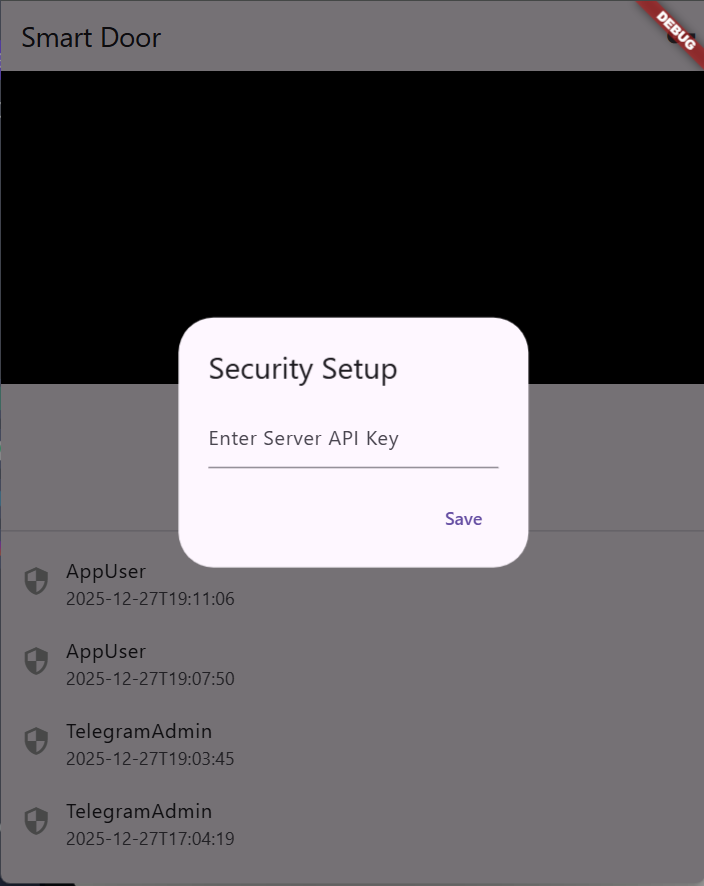
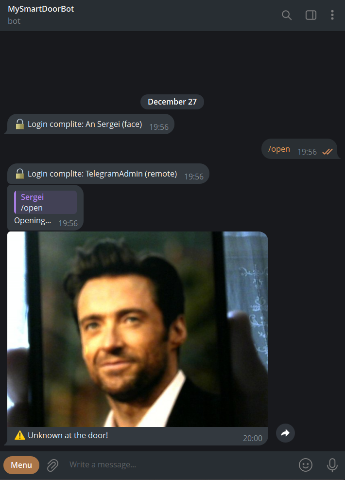

# IoT Smart Door System with Face Recognition & Mobile Control

A secure, DIY smart access control system powered by **Raspberry Pi**, **Computer Vision**, and a cross-platform **Flutter App**. This project combines facial recognition, QR code guest access, and remote management via Telegram and a mobile application.

## Interface Gallery

| Hardware Setup |
|:--------------------:|
|  |


| Mobile App (Flutter) | Telegram Bot (Alerts & QR) |
|:--------------------:|:--------------------------:|
|  |  |

---

## Key Features

* **Face ID Access:** Automatically unlocks the door when a known face is detected (using `face_recognition` and OpenCV).
* **QR Code Guest Access:** Generate temporary QR codes via Telegram for guests. The camera scans and validates them instantly.
* **Mobile App (Flutter):** * Real-time video streaming (MJPEG).
    * **Biometric Security:** Requires FaceID/TouchID on the phone to unlock the door remotely.
    * Access Logs history.
* **Telegram Bot Integration:** * Receive alerts with photos when an unknown person is detected.
    * Remote unlocking via command `/open`.
    * Manage users and generate QR codes via `/invite`.
* **Secure API:** All requests are protected by a custom API Secret Key.

---

## Tech Stack

### Hardware
* **Raspberry Pi 4** (Server & Processing)
* **Pi Camera Module** (or USB Webcam)
* **Servo Motor** (Mechanism)
* **Relay Module** (Lock control - Low/High trigger)

### Software
* **Backend:** Python 3.9+, FastAPI, Uvicorn, SQLite, SQLAlchemy.
* **Computer Vision:** OpenCV, face_recognition, qrcode.
* **Frontend:** Flutter (Android/iOS/Web).
* **Notifications:** pyTelegramBotAPI.

---

## Installation & Setup

### 1. Backend (Raspberry Pi)

Clone the repository and navigate to the backend folder:

```bash
cd backend
python3 -m venv venv
source venv/bin/activate
pip install -r requirements.txt
```

**Configuration:**
Open `main.py` and configure your settings:
```python
TELEGRAM_TOKEN = "YOUR_BOT_TOKEN"
ADMIN_ID = 123456789  # Your Telegram User ID
API_SECRET_KEY = "your_super_secret_key"
```

**Run the Server:**

```bash
python3 main.py
```

### 2. Mobile App (Flutter)

Navigate to the app folder:

```bash
cd mobile_app
flutter pub get
```

**Configuration:**
Open lib/main.dart and set your Raspberry Pi IP:
```dart
static const String baseUrl = '[http://192.168.1.](http://192.168.1.)XX:8000';
```

Run:
```bash
# For Web (Chrome)
flutter run -d chrome --web-renderer html

# For Android
flutter run
```

## Usage Guide

1.  **Enroll a Face:**
    * Currently managed via backend script `pickle` generation (or via manual logic implementation).

2.  **Guest Access:**
    * Open the Telegram Bot.
    * Type `/invite GuestName`.
    * Send the generated QR code to your guest.
    * Guest shows the QR code to the camera -> **Door opens**.

3.  **Remote Open:**
    * Open the Mobile App.
    * Enter your **API Key** (required only on first launch).
    * Tap **"Open Door"** -> Authenticate with **Fingerprint/FaceID** -> Success.

---

## Security Note

* **Local Processing:** Facial recognition is performed locally on the Raspberry Pi; no biometric data or images are sent to the cloud (except for Telegram intrusion alerts).
* **API Security:** The FastAPI endpoints are protected by a custom secret key. The Flutter app stores this API Key in the device's encrypted secure storage (Keychain/Keystore).
